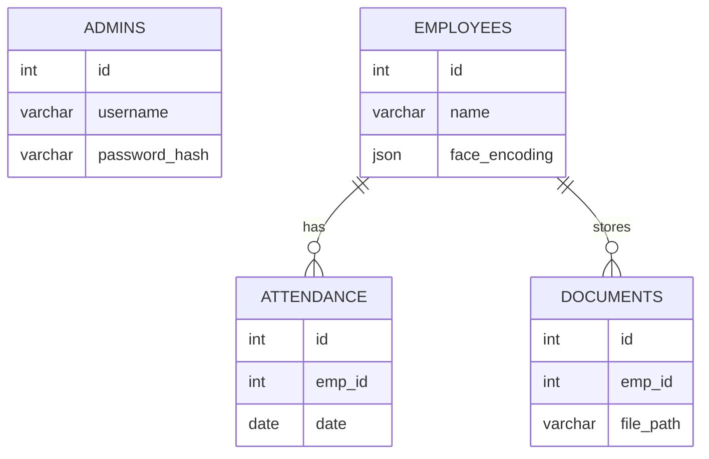
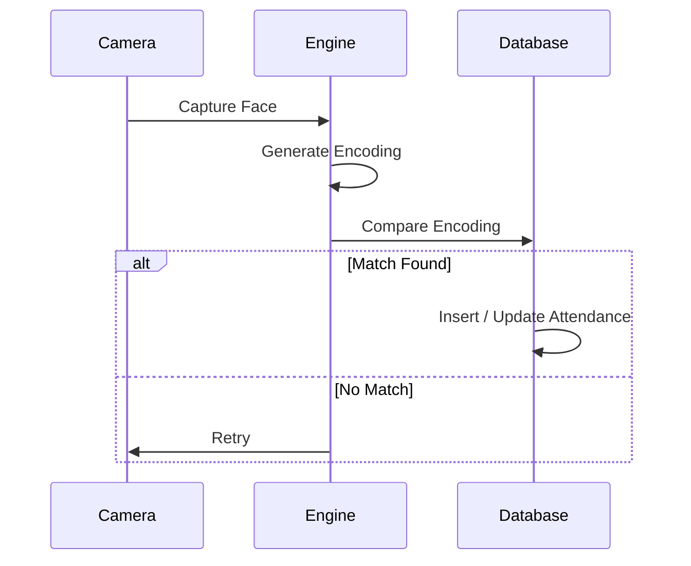

<div align="center">

# FaceRecognize – Enterprise Face Recognition Attendance System

### Automated biometric workforce attendance powered by real-time facial recognition, MySQL, and intelligent employee management.

<br>


</div>

---

## 📌 Overview

**FaceRecognize** is a desktop-grade AI-powered attendance and employee management system designed for organizations seeking secure and automated workforce tracking.

The system uses:
- Real-time face recognition
- Webcam-based attendance
- MySQL database integration
- Employee document management
- Automated check-in/check-out logic
- Tkinter-based GUI dashboard

The application eliminates proxy attendance, reduces HR overhead, and centralizes employee records into a single integrated desktop platform.

---

## 🎯 Problem Statement

Traditional attendance systems suffer from several limitations:

- Proxy attendance using cards or PINs
- Manual spreadsheet management
- Inaccurate attendance records
- Scattered employee documents
- No real-time attendance visibility
- Weak security and authentication

Managing employee attendance, payroll-ready logs, and HR records becomes increasingly inefficient without automation.

---

## ✅ Proposed Solution

FaceRecognize combines:
- Computer vision
- Facial biometrics
- MySQL database systems
- Desktop automation

into a unified attendance platform.

The system:
1. Detects faces using OpenCV + dlib
2. Generates facial embeddings
3. Matches encodings against stored employee profiles
4. Automatically marks attendance
5. Stores records in MySQL
6. Provides a GUI dashboard for HR management

Everything operates locally without cloud dependency.

---

# 🚀 Key Features

- 🔐 Secure admin authentication
- 👤 Employee profile management
- 📸 Real-time face recognition attendance
- 🕒 Automated check-in/check-out
- 📂 Employee document storage
- 📊 Attendance history tracking
- 💰 Salary projection support
- 🔔 Visa expiry notifications
- 🎨 Light/Dark theme support
- 📦 Standalone Windows executable
- 🏢 Department-wise employee organization
- 🧠 Face encoding enrollment system
- 📋 Editable attendance records
- 🖥️ Offline local deployment

---

# 🏗 System Architecture

```mermaid
graph LR
    A[Webcam] --> B(OpenCV Face Detection)
    B --> C(dlib Face Encoding)
    C --> D{Encoding Match}
    D -->|Matched| E[Attendance Marking]
    D -->|Unknown| F[Reject / Retry]

    G[GUI Dashboard] --> H[(MySQL Database)]
    H --> E
    H --> I[Employee Data]
````

---

# 🧱 Software Architecture

```text
┌──────────────────────────────────────┐
│            GUI Layer                 │
│      Tkinter Dashboard & Forms       │
├──────────────────────────────────────┤
│         Business Logic Layer         │
│    Validation, Attendance, Auth      │
├──────────────────────────────────────┤
│      Face Recognition Engine         │
│   Detection, Encoding, Comparison    │
├──────────────────────────────────────┤
│          Database Layer              │
│       PyMySQL Query Handling         │
├──────────────────────────────────────┤
│          Storage Layer               │
│ Local Documents & Settings Handling  │
└──────────────────────────────────────┘
```

---

# 🔬 Face Recognition Pipeline

The application uses the `face_recognition` library built on top of **dlib**.

## Workflow

1. Webcam captures live frames
2. OpenCV preprocesses the image
3. dlib detects facial regions
4. Face encoding generates a 128-dimensional vector
5. Stored employee encodings are compared
6. Attendance is automatically marked if matched

---

## Recognition Logic

* Face encodings stored as JSON vectors
* Euclidean distance matching
* Approximate threshold tolerance: `0.6`
* Duplicate attendance prevention enabled
* Automatic check-in/check-out workflow

---

# 💾 Database Architecture

The application uses MySQL with four core tables.

| Table        | Purpose                   |
| ------------ | ------------------------- |
| `admins`     | Admin credentials         |
| `employees`  | Employee master records   |
| `attendance` | Daily attendance logs     |
| `documents`  | Employee document storage |

---

## Entity Relationship Diagram



---

# 👤 Authentication System

The system includes:

* Admin registration
* Login validation
* SHA-256 password hashing
* Company-key verification
* Session handling

The company key mechanism prevents unauthorized admin account creation.

---

# ⏱ Attendance Workflow



---

# 👥 Employee Management System

Features include:

* Employee registration
* Department assignment
* Face enrollment
* Document uploads
* Salary fields
* Employee search/filtering
* Attendance history viewing
* Profile management

---

# 📂 Document Storage System

Employee documents are stored locally.

Supported:

* Visa documents
* Emirates ID
* Labour card
* Profile images

Storage path structure:

```text
C:\Users\<Username>\company_docs\
```

File paths are indexed in MySQL.

---

# 🎨 Graphical User Interface

The GUI is built using Tkinter.

## Main Screens

* Login Screen
* Registration Screen
* Dashboard
* Employee Management
* Attendance Scanner
* Notifications
* Attendance Editor
* Employee Detail View

---

# 💻 Technology Stack

| Component          | Technology              |
| ------------------ | ----------------------- |
| Language           | Python                  |
| GUI                | Tkinter                 |
| Face Detection     | OpenCV                  |
| Face Recognition   | dlib + face_recognition |
| Database           | MySQL                   |
| ORM/Connector      | PyMySQL                 |
| Image Handling     | Pillow                  |
| Numeric Processing | NumPy                   |
| Packaging          | PyInstaller             |
| Platform           | Windows                 |

---

# 📁 Project Structure

```text
FaceRecognize/
│
├── main.py
├── main.spec
├── requirements.txt
├── user_manual.txt
├── Company_logo.jpg
├── settings.json
├── dbpwd.txt
├── dist/
├── build/
└── company_docs/
```

---

# ⚙️ Installation & Setup

## Prerequisites

* Windows 10 / 11
* Python 3.9 or 3.10
* MySQL Server 8.0+
* Webcam

---

## Method A — Run from Source

```bash
pip install -r requirements.txt
python main.py
```

---

## Method B — Build Executable

```bash
pip install pyinstaller

pyinstaller main.spec
```

Generated executable will appear inside:

```text
dist/
```

---

# 🗄 Database Setup

Create the database:

```sql
CREATE DATABASE company_db;
```

Import required tables from the provided setup SQL.

---

# 🏃 Running the Application

1. Launch the application
2. Register an admin account
3. Login
4. Add employees
5. Capture employee face
6. Start attendance scanning

Attendance is automatically recorded when a known face is detected.

---

# 📦 Executable Packaging

The project supports standalone deployment using PyInstaller.

The `.spec` file:

* Bundles dlib models
* Includes assets and logo
* Packages hidden imports
* Creates a GUI-only executable

No Python installation is required on the target system.

---

# 🔧 Troubleshooting

| Problem                   | Solution                            |
| ------------------------- | ----------------------------------- |
| Camera not opening        | Close other webcam applications     |
| MySQL connection failure  | Verify MySQL service and password   |
| dlib installation failure | Install VC++ Redistributables       |
| EXE crashes               | Run from terminal to inspect errors |
| Missing logo              | Ensure Company_logo.jpg exists      |

---

# 🔒 Security Considerations

* Passwords are SHA-256 hashed
* Attendance records stored locally
* Face encodings stored in MySQL
* Local document storage should be access restricted
* Company-key should be changed for production use

---

# 🧠 Future Improvements

* Anti-spoof detection
* Multi-camera support
* Cloud synchronization
* Docker deployment
* Web dashboard
* Mobile application
* AI attendance analytics
* Role-based access control
* Deep learning face models

---

# 📚 Research & Academic Value

This project demonstrates:

* Computer vision integration
* Real-time biometric authentication
* Database engineering
* Desktop software architecture
* Human-computer interaction
* AI deployment in workforce systems

It serves as a practical implementation of applied AI and biometric attendance automation.

---

# 👥 Contributors

| Role                    | Contributor     |
| ----------------------- | --------------- |
| Lead Developer          | Subhajit Halder |
| Testing & Documentation | Placeholder     |
| UI/UX Design            | Placeholder     |

---

# 📄 License

This project is licensed under the MIT License.

---

# 🎉 Conclusion

FaceRecognize combines AI-powered facial biometrics with desktop automation to deliver a practical, scalable, and secure workforce attendance platform.

By integrating:

* Computer vision
* Database systems
* GUI engineering
* Biometric authentication

the project demonstrates how modern AI technologies can simplify workforce management while remaining fully deployable on local infrastructure.

---

<div align="center">

Built with ❤️ at Jalpaiguri Government Engineering College

</div>
```
